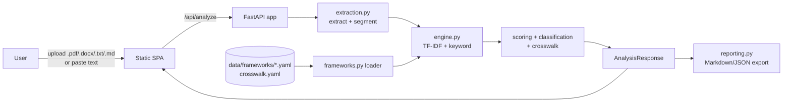

# Architecture

## Overview

The AI Governance Tracker is a single FastAPI service that serves both a JSON API
and a static single-page UI. It is intentionally **stateless** and **offline-first**:
documents are analysed in-memory and nothing is persisted by default, which keeps the
draft simple and privacy-preserving.

## Components

| Module | Responsibility |
| --- | --- |
| `app/main.py` | HTTP routes, upload handling, error mapping, static mount. |
| `app/extraction.py` | Format-specific text extraction; whitespace normalisation; paragraph/sentence **segmentation**. |
| `app/frameworks.py` | Loads declarative YAML frameworks + crosswalk into cached dataclasses. |
| `app/engine.py` | The pluggable mapping engine. Blends semantic similarity and keyword coverage, classifies controls, rolls up weighted scores, builds the crosswalk. |
| `app/reporting.py` | Renders an `AnalysisResponse` to a shareable Markdown report. |
| `app/schemas.py` | Pydantic request/response contracts (also the OpenAPI schema). |
| `app/static/` | Vanilla-JS SPA (no build step) — framework picker, upload/paste, dashboard, crosswalk, export. |

## Data model (knowledge base)

Each framework is a YAML document with a list of **controls**. A control captures a
single obligation/requirement and the signals used to detect it:

- `id`, `title`, `reference` (article/clause), `category`, `weight` (importance 1–5)
- `description` — plain-language summary used for semantic matching
- `keywords` — curated domain terms used for keyword coverage
- `expected_evidence` — what good coverage looks like; drives recommendations

A separate `crosswalk.yaml` groups conceptually-equivalent controls across frameworks
into **themes** (e.g. *risk management* maps EU AI Act Art. 9 ↔ ISO 42001 Clause 6.1 ↔
NIST MAP/MANAGE). This powers the unified cross-framework view and means evidence found
for one framework can be reasoned about for related controls in another.

## Scoring pipeline

1. **Segment** the policy into concise passages.
2. Fit a shared TF-IDF space over `segments + control queries` (control query =
   title + description + keywords) using a light stemmer and unigrams+bigrams.
3. For each control: `semantic = max cosine` over passages (scaled), `keyword =`
   fraction of stemmed keywords present in the doc.
4. `score = 0.5·semantic + 0.5·keyword`; classify with per-framework thresholds.
5. Attach top evidence passages (above a similarity floor) and a recommendation for
   any `partial`/`gap` control.
6. Roll up to a **weighted** framework compliance score and an overall score.

## Why this design

- **Offline by default** — no data leaves the process; works in air-gapped/regulated
  environments and in CI without secrets. Sensitive policy text never hits a 3rd party.
- **Declarative knowledge base** — adding/maintaining frameworks is a YAML edit, not a
  code change. This is where most ongoing maintenance happens as regulations evolve.
- **Pluggable engine** — `TfidfEngine` implements an `analyze(text, framework_ids)`
  contract via `get_engine()`. A future `EmbeddingEngine` / `LLMEngine` can be swapped
  in behind the same interface and the same API/UI (see `ROADMAP`).
- **Explainable** — every score is backed by visible evidence passages and matched
  keywords, which is essential for an auditing/compliance context.

## Trade-offs & known limitations

- Lexical matching ≠ semantic understanding; embeddings/LLMs would improve recall and
  precision at the cost of dependencies, latency, and (for LLMs) data-egress concerns.
- Control sets are representative summaries, not the full legal text.
- No persistence/auth/multi-tenancy yet (stateless draft) — addressed in the roadmap.
